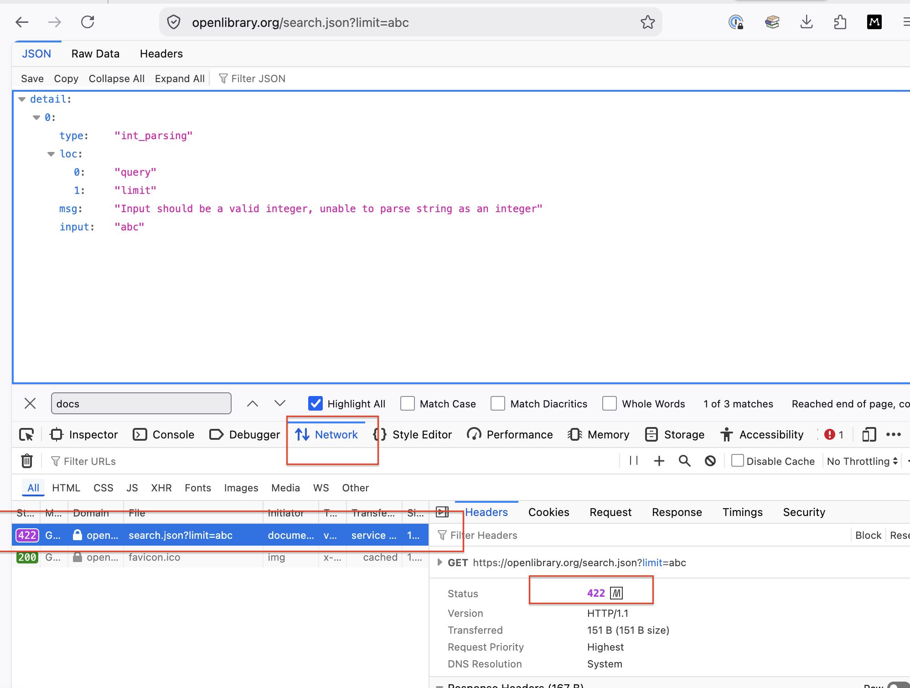

# Notes on Open Library Search API

## API documentation
1. Started with the Open Library Search API documentation:
https://openlibrary.org/dev/docs/api/search

## Find the API
2. I sent the following request in Firefox (put into Firefox browser)
https://openlibrary.org/search.json?q=harry+potter

## Nell Version 1 Notes
3. **Open Inspector**
Do Cmd + Option + I to open inspector --> Now you're looking at a GET request
- Click Network
- **reload page**
- Cmd + R -> search.json --> click that row
- Find the open panel
    - Status code: 200
    - Response header: content type
    - application-json = tells you it's JSON

JSON fields I observed:
- numFound: 4063
- docs: list of search results
- title: Harry Potter and the Chamber of Secrets
- author_name: J.K. Rowling
- first_publish_year: 1997
- isbn: 9788204086600

## Request and response summary

Request
- HTTP method: GET
- Endpoint: /search.json
- Query parameter: q
- Query value: harry potter

Response
Status code: 200 OK
Response content type: application/json

### Unsuccessful request, changing 2 variables
- I purposefully triggered an error by supplying an invalid value for limit and the API returned an error response.

Changed URL: https://openlibrary.org/search.json?limit=abc

The limit parameter expects an integer, but I supplied the string abc.

#### Response
- Status code: 422 Unprocessable Content
- Error message: "Input should be a valid integer, unable to parse string as an integer"
- Response format: JSON

### Unsuccessful request attempt 2, changing only 1 variable

	Successful request	             Unsuccessful request
Method	    GET	                    GET
Endpoint	/search.json	        /search.json
Parameter	q=harry+potter	        limit=abc
Status	    200 OK	                 422 Unprocessable Content
Response	Search results	        Validation error
Format	    JSON	                JSON

### Information required from the documentation

To make the successful search request, I needed to know:

The HTTP method: GET
The endpoint: /search.json
The q = query parameter
That q contains the search terms
The API's base URL: https://openlibrary.org

The documentation also provides information about other available query parameters, including limit.

No authentication was required for this request.

### Friction points
- The API documentation requires the user to understand the relationship between the endpoint and its query parameters.
- The raw JSON response contains a large amount of information, which can make it difficult for a beginner to identify the most important fields.
- The error response was more useful than a generic error because it identified the problem with the limit value and explained that an integer was expected.

### Recommended improvements
- Provide a complete copy-and-paste example request directly next to the endpoint documentation.
- Clearly identify which parameters are required and which are optional.
- Include an example of a successful response with explanations of the most important JSON fields.
- Include common error responses, including the status code, cause of the error, and example response.
- Explain expected parameter data types, such as stating explicitly that limit must be an integer.